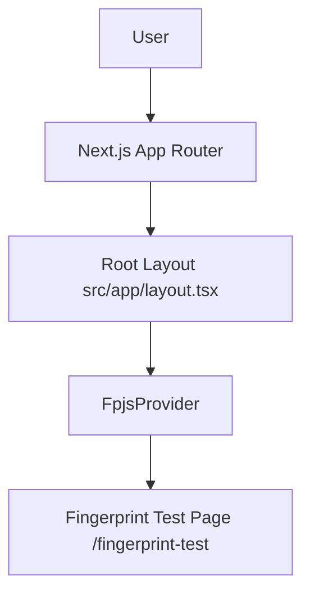

## Архитектура проекта

Приложение построено на Next.js (App Router) с корневым лэйаутом `src/app/layout.tsx` и страницами в `src/app/*`. Используются Tailwind CSS, Radix UI, React 19.

### Интеграции
- Yandex.Metrika: подключена через `next/script` в `src/app/layout.tsx`.
- Google Tag Manager: компоненты `GoogleTagManagerHead` и `GoogleTagManagerBody` в `src/app/layout.tsx`.
- Fingerprint Pro React SDK: провайдер `FpjsProvider` в `src/app/layout.tsx` с конфигурацией региона `eu` и ключом из `NEXT_PUBLIC_FPJS_API_KEY`.

### Новые компоненты и страницы
- `src/app/fingerprint-test/page.tsx` — клиентская страница для проверки интеграции Fingerprint (выводит `visitorId` и полный ответ SDK, доступна по маршруту `/fingerprint-test`).

### Переменные окружения
- `NEXT_PUBLIC_FPJS_API_KEY` — публичный ключ Fingerprint Pro, используется в клиентском провайдере.

### Диаграмма (Mermaid)

